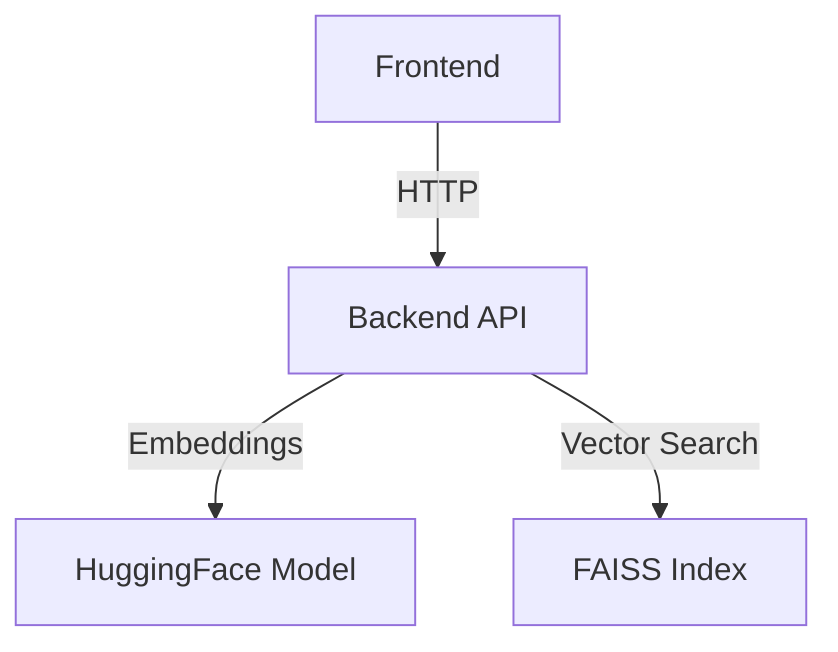

# Math College RAG System

Retrieval-Augmented Generation system for math education.

## System Architecture


## Prerequisites
- Node.js 18+ (Frontend)
- Python 3.10+ (Backend)
- CUDA 11.8 (Recommended for GPU)

## Setup
### Backend First
```bash
cd backend
pip install -r requirements.txt
uvicorn main:app --reload
```

### Then Frontend
```bash
cd frontend
npm install
npm start
```

### Option 2: Manual
1. Backend production:
   ```bash
   uvicorn main:app --host 0.0.0.0 --port 8000
   ```
2. Frontend production:
   ```bash
   npm run build
   serve -s build -l 3000
   ```

## Environment Variables
### Backend
| Variable | Description |
|----------|-------------|
| `FAISS_INDEX_PATH` | Path to vector store |

### Frontend
| Variable | Description |
|----------|-------------|
| `REACT_APP_API_URL` | Backend URL |